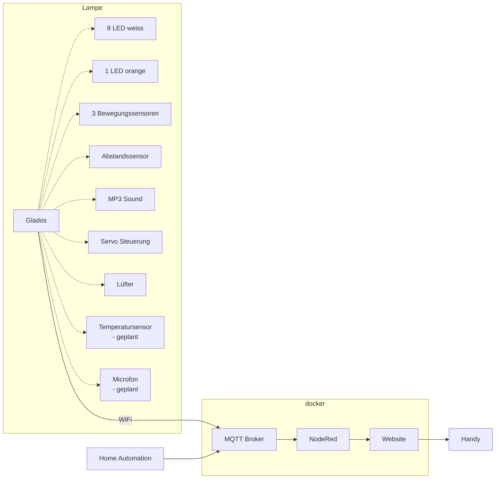

# Übersicht
Das Projekt teilt sich in drei Teile
- [3D Druck](./de_printing.md)
- [Elektronik](./de_electronics.md)
- [Software](./de_software.md)

## Allgemein
Eine gute Übersicht geben folgende Links:
- https://ytec3d.com/glados-lamp/
- https://www.instructables.com/A-fully-3D-printable-GlaDOS-Robotic-ceiling-arm-la/

Darüber hinaus möchte diese Projekt in folgenden Punkten unterstützen:
- Optimierter 3D Druck durch angepasste STL Dateien
- Mikrocontroller Steuerung
- Heimintegration
- Schritt für Schritt Aufbauanleitung

### Architektur
Folgendes Diagramm zum verstehen der Architektur
