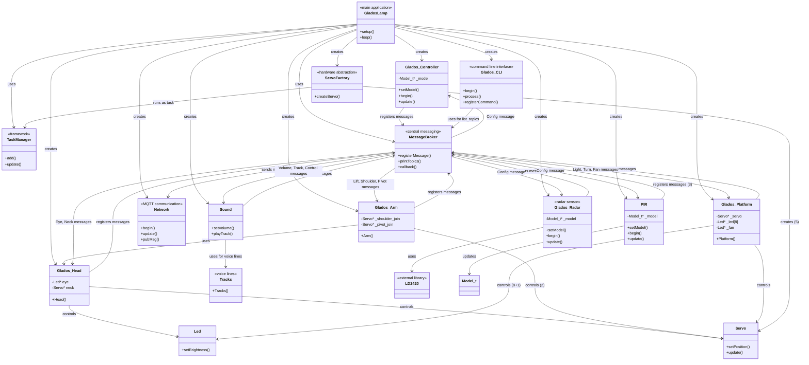

# Software

## Object Diagram

```mermaid
classDiagram
    class GladosLamp {
        +setup()
        +loop()
    }
    
    class TaskManager {
        +add()
        +update()
    }
    
    class Glados_Controller {
        -Model_t* _model
        +setModel()
        +begin()
        +update()
    }
    
    class Glados_Head {
        -Led* eye
        -Servo* neck
        +Head()
    }
    
    class Glados_Arm {
        -Servo* _shoulder_join
        -Servo* _pivot_join
        +Arm()
    }
    
    class Glados_Platform {
        -Servo* _servo
        -Led* _led[8]
        -Led* _fan
        +Platform()
    }
    
    class Glados_Radar {
        -Model_t* _model
        +setModel()
        +begin()
        +update()
    }
    
    class Glados_CLI {
        +begin()
        +process()
        +registerCommand()
    }
    
    class MessageBroker {
        +registerMessage()
        +printTopics()
        +callback()
    }
    
    class Network {
        +begin()
        +update()
        +pubMsg()
    }
    
    class ServoFactory {
        +createServo()
    }
    
    class Servo {
        +setPosition()
        +update()
    }
    
    class Led {
        +setBrightness()
    }
    
    class Sound {
        +setVolume()
        +playTrack()
    }
    
    class PIR {
        -Model_t* _model
        +setModel()
        +begin()
        +update()
    }
    
    class Tracks {
        +Tracks[]
    }
    
    GladosLamp --> TaskManager : uses
    GladosLamp --> Glados_Controller : creates
    GladosLamp --> Glados_Head : creates
    GladosLamp --> Glados_Arm : creates
    GladosLamp --> Glados_Platform : creates
    GladosLamp --> Glados_Radar : creates
    GladosLamp --> Glados_CLI : creates
    GladosLamp --> Network : creates
    GladosLamp --> Sound : creates
    GladosLamp --> ServoFactory : creates
    GladosLamp --> PIR : creates
    GladosLamp --> MessageBroker : uses
    
    Glados_Controller --> MessageBroker : registers messages
    Glados_Head --> MessageBroker : registers messages
    Glados_Arm --> MessageBroker : registers messages
    Glados_Platform --> MessageBroker : registers messages
    Glados_Radar --> MessageBroker : registers messages
    Glados_CLI --> MessageBroker : uses for list_topics
    Sound --> MessageBroker : registers messages
    PIR --> MessageBroker : registers messages (3)
    
    Glados_Head --> Led : controls
    Glados_Head --> Servo : controls
    
    Glados_Arm --> Glados_Head : uses
    Glados_Arm --> Servo : controls (2)
    
    Glados_Platform --> Servo : controls
    Glados_Platform --> Led : controls (8+1)
    
    Glados_Radar --> LD2420 : uses
    PIR --> Model_t : updates
    Sound --> Tracks : uses for voice lines
    
    MessageBroker --> Network : sends messages
    MessageBroker --> Glados_Controller : Config message
    MessageBroker --> Glados_Head : Eye, Neck messages
    MessageBroker --> Glados_Arm : Lift, Shoulder, Pivot messages
    MessageBroker --> Glados_Platform : Light, Turn, Fan messages
    MessageBroker --> Glados_Radar : Config message
    MessageBroker --> Sound : Volume, Track, Control messages
    MessageBroker --> PIR : Config message
    
    ServoFactory --> Servo : creates (5)
    ServoFactory --> TaskManager : runs as task
    
    class GladosLamp {
        <<main application>>
    }
    
    class TaskManager {
        <<framework>>
    }
    
    class MessageBroker {
        <<central messaging>>
    }
    
    class Network {
        <<MQTT communication>>
    }
    
    class ServoFactory {
        <<hardware abstraction>>
    }
    
    class Glados_Radar {
        <<radar sensor>>
    }
    
    class Glados_CLI {
        <<command line interface>>
    }
    
    class Tracks {
        <<voice lines>>
    }
    
    class LD2420 {
        <<external library>>
    }
```
